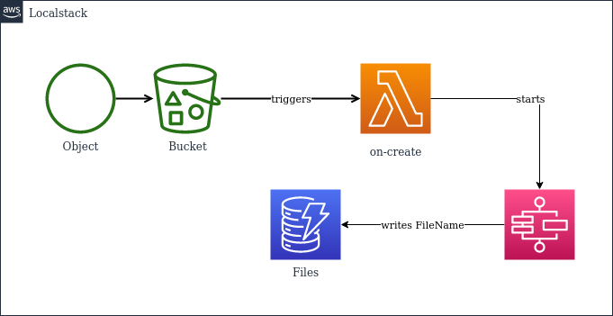

### Project Architecture

 

I followed a modularized approach in this project. Each resource has been designed to be in seperate modules with data being passed on between them via terraform variables.

### Terraform Infrastucture

Following resources are created in this project

- DynamoDB Table

- AWS Lambda Function

- S3 Bucket

- Step Function State Machine

### Prerequisites

Before starting,I have installed Terraform on my local machine and configured AWS account credentials with appropiate permissions. Additionaly as a best practice I configured an S3 bucket as the backend for Terraform and used DynamoDB for state locking.

### Terraform File Structure

The Terraform configuration is organized into modules:

- Modules/Step_Function: Defines the Step Function State Machine.

- Modules/Lambda: Configures the AWS Lambda function.

- Modules/S3_Bucket: Manages the S3 Bucket.

- Modules/DynamoDB: Sets up the DynamoDB Table.

## Files Explanation

- main.tf: Main Terraform configuration file that invokes modules with necessary variables.

- variables.tf: Defines input variables used throughout the configuration.

- provider.tf: Specifies the AWS provider configuration.

- backend.tf: Configures the backend for storing Terraform state.

- output.tf: Defines output variables to display after Terraform applies changes.

### How does it works

- S3

  I created a S3 bucket and utilized the S3 event notification to invoke a lambda function when a new object is uploaded to the newly created S3 bucket.

- Lambda

  When lambda function invoked,it iterates through the record list in the event recieved and filters out the file name using the python script and invokes the Step Function. The filtered file name is passed as an input to the step function.

- Step Function

  The Step function utilizes dynamodb integration to insert the record to dynamodb.

- DynamoDB

  I have created a dynamodb with table name "Files" and key name as "FileName"

  ### Future Improvemnts

  - Monitoring and Logging: 
    Implement monitoring and logging solutions to track the performance and health of your infrastructure. This could include setting up CloudWatch alarms, logging Lambda function execution, and monitoring DynamoDB table activity.

  - Scaling Capabilities: 
    Implementing auto-scaling for Lambda functions based on metrics like incoming traffic or resource utilization and configuring DynamoDB auto-scaling to accommodate varying read and write throughput requirements.

  - Cost Optimization
    Removing the Step Function from the architecture is feasible since Lambda can directly insert data into DynamoDB, resulting in potential cost savings.

